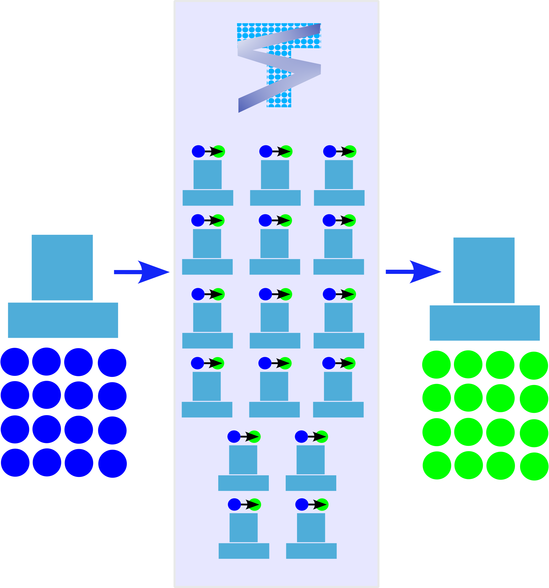

Welcome to tensorscout's documentation!
=======================================

What if for some reason, you could unlock 100% of your processing power?
-------------------------------------------------------------------------------------

  A single computer leveraging the multiprocessing capabilities of tensorscout to distribute tasks to 16 computers and aggregate the results back to the original machine.

.. 
  |icon|

This Python package is simply, a collection of decorators that streamline the use of parallel processing with Python. These decorators are powered by `pathos <https://pathos.readthedocs.io>`_ 
and allow users to distribute operations over multiple CPU cores or vCPUs (with cloud computing), 
significantly reducing the time required for computation. 

Specifically, these decorators allow users to partition arrays into sectors and allocate 
operations for each sector over the defined available cores. The package currently does not include support for GPUs for faster processing, 
thought it may be a desired feature for the future. 

Overall, this package is ideal for users working with large-scale tensor operations and seeking to optimize performance through parallel processing.

Check out the :doc:`usage` section for further information, including how to :ref:`installation` the project. 

.. 
  Colab Notebook
  ..............................

  In progress

  .. image:: ../img/colaboratory.png
    :width: 500
    :alt: Alternative text

.. note::

   This project is under active development.

Contents
--------

.. toctree::

   usage
   api

