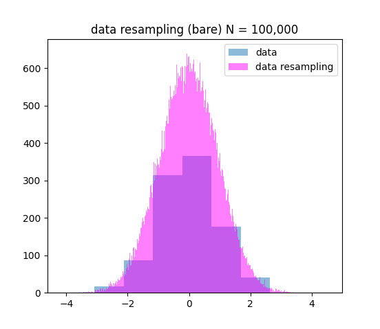
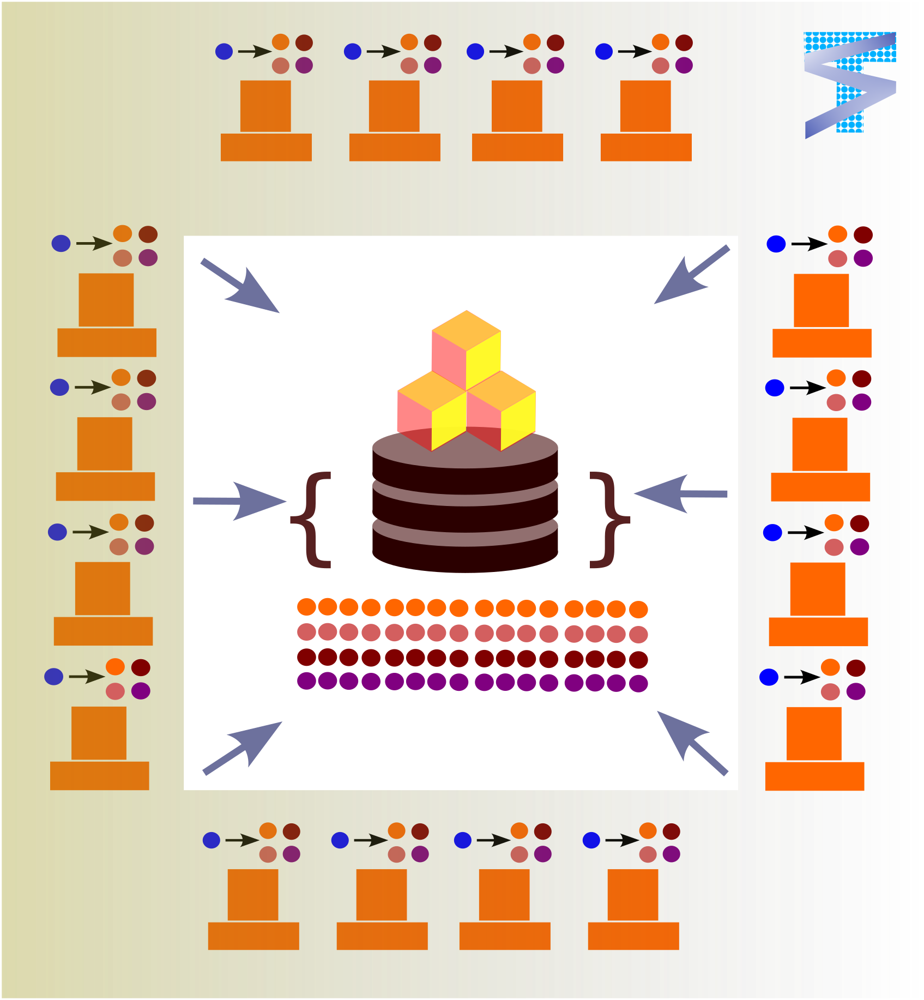

Usage
=====

.. _installation:

Installation
------------

It is recommended you use voxelmap through a virtual environment. You may follow the below simple protocol to create the virtual environment, run it, and install the package there:

.. code-block:: console
   
   $ virtualenv venv
   $ source venv/bin/activate
   (.venv) $ pip install tensorscout

To exit the virtual environment, simply type ``deactivate``. To access it at any other time again, enter with the above ``source`` command.

Simulations and/or sampling with multiple processors
----------------------------------------------------------------

Simple Return Value 
...........................

When performing Monte Carlo sampling at a high number, it can significantly impact computing power. 
To address this, we have developed the ``@multicarlo`` decorator, which allocates a specific number of iterations to
a defined number of available processors or cores. In our case, since we have a computer with 4 cores, we have set
the num_cores to 4. However, you can set it to as many cores as your computer or server may have available. 

In this example, we compare the runtime performance of this multiprocessing decorator with the bare approach, 
which uses a single core. We begin by importing all the required modules and defining a function that is used
in both approaches to avoid redundancy.

.. code-block:: python

   import tensorscout as scout
   import numpy as np
   import matplotlib.pyplot as plt
   from timethis import timethis

   def make_histograms(data,results, title):
      plt.figure()
      plt.title(title+' N = 100,000')
      plt.hist(data,bins = 7, alpha=0.5,label='data')
      plt.hist(results,bins=600,alpha=0.5,color='magenta',label='data resampling')
      plt.legend()

   print()
   data = np.random.normal(0, 1, 1000)

The operations we run on both methodologies are random sampling operations which take random numbers from the ``data`` distribution defined above, which is a distribution made from 1,000 samples from 
a Gaussian distribution with a mean of ``0`` and standard deviation of ``1``. For both methods, we set the number of samples to 100,000, which is a considerable amount. 
In the following code block, we apply the ``@multicarlo`` decorator to our random sampling function ``monte_carlo_function``
and distribute the sampling iterations across four cores. 

The ``timethis()`` function is used to record the run times of both methods and print them as a terminal output.

.. code-block:: python

   title = 'data resampling (with @multicarlo -- 4 cores)'
   with timethis(title):
      @scout.multicarlo(num_iters=100000, num_cores=4)
      def monte_carlo_function(data, *args, **kwargs):
         simulated_data = np.random.normal(np.mean(data), np.std(data))
         return simulated_data

      results = monte_carlo_function(data)
      print('number unique results: {}/{}'.format(len(np.unique(results)),len(results)))

      make_histograms(data,results,title)

   print('...........................................................')

      
The following code block executes the same tasks as the previous block, but using a bare approach, 
meaning that it uses a single core to perform all 100,000 random samples.

.. code-block:: python

   title='data resampling (bare)'
   with timethis(title):

      def monte_carlo_function_bare(data, *args, **kwargs):
         simulated_data = np.random.normal(np.mean(data), np.std(data))
         return simulated_data

      results = [monte_carlo_function_bare(data) for i in range(100000)]
      print('number unique results: {}/{}'.format(len(np.unique(results)),len(results)))
      make_histograms(data,results,title)
   
   #make plots for both approaches
   plt.show()

The output for the previous three code blocks is displayed below.

.. |multicarlo| image:: ../img/multicarlo.png
  :width: 320
  :alt: Alternative text

|multicarlo| |multicarlo bare|

>>> [OUT]
number unique results: 100000/100000
data resampling (with @multicarlo -- 4 cores): 3.726 seconds
...........................................................
number unique results: 100000/100000
data resampling (bare): 6.478 seconds

We compared multiprocessing and naive methods for generating random numbers and tracked the number of unique results.
This showed that multiprocessing generated unique random numbers across different cores. 
Both methods produced similar random sampling distributions, but the multiprocessing approach using ``@multicarlo`` with 4 cores showed around a runtime improvement of 170% over the bare approach.

Campfire: Generating a Multiprocessing-Powered Dictionary 
...............................................................

  Much like a campfire which brings people together and allow for sharing stories and experiences, 
  this decorator brings together the results of simulations across ``num_cores`` multiple processors and regroups them in a dictionary by key.

If the algorithm is refined further, we may consider ``campfire`` a more powerful method decorator than the former because dictionaries can return several outputs and may be accessed by their keys. 
The below example is from the Python tests section
and shows how to return values from a "simulation" stored in ``x`` ``y`` ``z`` keys. 

.. code-block:: python

   def unique(key='x'): return len(np.unique(map[key]))

   with timethis("campfire dictionary"):

      @scout.campfire(num_iters=400, num_cores=4)
      def simulation(data):
         for i in range(1000):
               'the above 1,000 iters is to stress-test  the campfire method against the bare (no multiproc) method (in the end, only the last samples from x y and z are returned)'
               x = [np.random.normal(0, 1) for i in range(5)]
               y = [np.random.normal(0, 1) for i in range(5)]
               z = [np.random.normal(0, 1) for i in range(5)]
      
         return {'x': x, 'y': y, 'z': z}

      data = 'c'
      map = simulation(data)
      print('unique samples -- x: {}, y: {}, z: {}'.format(unique('x'),unique('y'),unique('z')) )  

   print('...................................................')

   with timethis("bare dictionary"):

      def simulation_bare(data, num_iters):
         X,Y,Z = [],[],[]
         for j in range(num_iters):
               for i in range(1000):
                  x = [np.random.normal(0, 1) for i in range(5)]
                  y = [np.random.normal(0, 1) for i in range(5)]
                  z = [np.random.normal(0, 1) for i in range(5)]
               X.extend(x), Y.extend(y), Z.extend(z)

         return {'x': X, 'y': Y, 'z': Z}

      data = 100
      map_bare = simulation_bare(data, num_iters=400)
      print('unique samples -- x: {}, y: {}, z: {}'.format(unique('x'),unique('y'),unique('z')) )  

>>> [OUT]
unique samples -- x: 2000, y: 2000, z: 2000
campfire dictionary: 3.013 seconds
...................................................
unique samples -- x: 2000, y: 2000, z: 2000
bare dictionary: 5.421 seconds

Notice how much additional scripting is needed to re-organize the data with simulations on a ``bare (no campfire)`` dictionary. 
Below we compare the 2000 ``x,y,z`` entries graphically between the ``campfire`` sampling and the naive ``bare`` sampling from above. 

|xyzcamp| |xyzbare|

Simulations with ``campfire`` (left) and with a naive ``bare`` approach (right). The above were drawn with the `voxelmap draw method for coordinates <https://voxelmap.readthedocs.io/en/latest/usage.html#draw-voxels-from-coordinate-arrays>`_ from the `voxelmap <voxelmap.readthedocs.io>`_ package

Parallel Computation on Sectorized Matrices using Multiprocessing
-------------------------------------------------------------------------

.. figure:: ../img/dallecake_cakerun.png
  :width: 300
  :alt: Alternative text
  :target: https://github.com/andrewrgarcia/voxelmap

The question of whether it's faster to eat a cake alone or have 100 people cut a slice and eat their portions until 
it's gone highlights the main concept behind the cakerun decorator. 
Essentially, the decorator partitions an array into a specified number of equally-sized sectors and performs 
the same task on all sectors in parallel. 

In this example, we set the number of cores to 4 and compare the performance of using multiprocessing versus
using a single core. Before proceeding, we import all necessary modules and define the draw function which is 
used in both approaches to avoid redundancy. Additionally, we define the initial matrix, which is a 252 x 252 matrix of 1s,
that will be operated on by both methodologies.

.. code-block:: python

   import tensorscout as scout
   import numpy as np
   import matplotlib.pyplot as plt
   from timethis import timethis

   num_iters = 40000

   def draw(result):
      plt.figure()
      plt.title('{} -- $N_{{perforated}}$ = {}'.format(title, np.multiply(*result.shape) - np.count_nonzero(result)))
      plt.imshow(result,cmap='bone')

   matrix = np.ones((252,252))

   plt.imshow(matrix,cmap='bone')
   plt.title('initial canvas')

..  figure:: ../img/black_canvas.png
  :width: 320
  :alt: Alternative text

In this example, the initial matrix is composed entirely of 1s and will appear as a single color when drawn. 
The purpose of this code is to apply an operation called "perforation" to the matrix. At each iteration, 
a random x-y coordinate is selected and the value at that location is set to 0.

The first case demonstrates the use of the ``@cakerun`` decorator to split the matrix into sectors and apply
the perforate function to each sector. The former code block specifies 40,000 perforating iterations, which for the case 
of this aprroach has them evenly distributed across the 4 sectors, resulting in 10,000 iterations per sector, ocurring simultaneously.

.. code-block:: python

   title = 'cakerun MP (4 cores)'
   with timethis("{}".format(title)):

      cores = 4
      @scout.cakerun(num_cores=cores, L_sectors=2)
      def perforate(sector):
         
         for i in range(num_iters // cores):
               cds = np.argwhere(sector!=0)
               sector[tuple(cds[np.random.randint(cds.shape[0])])] = 0 
         return sector

      result = perforate(matrix)
      draw(result)

In the next code block, the perforating operation is applied for 40,000 iterations using a bare approach with a single processor. 
Hence, there is no task split involved.

.. code-block:: python

   title = 'single core'
   with timethis("{}".format(title)):

      def perforate_bare(sector):
         for i in range(num_iters):
               cds = np.argwhere(sector!=0)
               sector[tuple(cds[np.random.randint(cds.shape[0])])] = 0 
         return sector

      result = perforate_bare(matrix)
      draw(result)

   plt.show()

The following are graphical and runtime comparisons of both methods:

.. |cakerun| image:: ../img/cakerun.png
  :width: 320
  :alt: Alternative text

|cakerun| |cakerun bare|

>>> [OUT]
cakerun MP (4 cores): 2.968 seconds
single core: 25.868 seconds

It is apparent that both approaches yield a similar outcome and have 
the same number of perforations. However, the ``@cakerun`` decorated function, which uses four 
cores simultaneously, has a runtime that is 8-9 times faster than the bare approach.